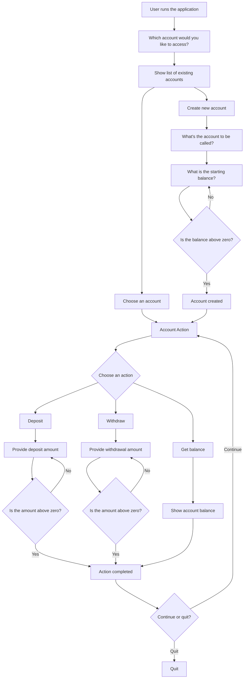

# Bank Account Simulator

A Kotlin project for learning the language by simulating a simple bank account.

## Specifications

- On startup, ask the user: "Do you want to create an account or access an existing account?"
- Create an account
- Choose which existing account to access
- Delete an account (only allowed if the account balance is zero)
- Deposit money into the account
- Withdraw money from the account
- Request the current account balance
- At any time, the user can press the Escape key to quit the application
- The programme has persistent state: accounts created in a session are saved and restored the next time the programme runs

## Application Flow

## Future Enhancements

- Use Asker as an external dependency for more pleasant command-line input
